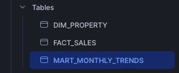

# Data Engineering Pipeline for Harvard, MA Home Sales

This project demonstrates an end-to-end data engineering pipeline using **Airflow**, **dbt**, and **Snowflake** to analyze home sales data from Redfin.

## Components
- **Airflow** orchestrates the ingestion and transformation jobs.
- **Snowflake** stores the raw and transformed data.
- **dbt** models the data into facts, dimensions, and marts.
- **Docker Compose** provides a simple local setup.

## Quickstart
1. Ensure Docker and Docker Compose are installed.
2. Place Redfin CSV at `data/redfin_harvard_ma.csv` or set `REDFIN_CSV_PATH`. 
3. Run `docker-compose up` to start all services.
4. Access Airflow at `http://localhost:8080` (use docker exec -it dataeng_datapipeline-airflow-1 bash to create an user).
5. Trigger the `house_sales_pipeline` DAG to load and transform the data.
6. Set your Snowflake credentials via environment variables in `docker-compose.yml` or an `.env` file.

## dbt
The dbt project lives in `house_dbt_project`. It includes models:
- `stg_house_sales` – staging view for raw data.
- `fact_sales` – cleaned fact table.
- `dim_property` – dimension of unique properties.
- `mart_monthly_trends` – aggregates for price trends.

To run dbt manually inside the container:
```bash
docker-compose run dbt dbt run
```

## Testing
Run dbt tests:
```bash
docker-compose run dbt dbt test
```

## Airflow DAG
The DAG defined in `airflow/dags/redfin_pipeline_dag.py` performs:
1. Load the CSV into Snowflake.
2. Execute `dbt run`.
3. Print completion message.

## Snowflake Setup
The table DDL can be found in `sql/create_staging_table.sql` and should be executed in your Snowflake account before running the pipeline.

## Documentation
Generate dbt docs:
```bash
docker-compose run dbt dbt docs generate
```
Then serve docs:
```bash
docker-compose run --service-ports dbt dbt docs serve
```
## Screenshots

Below are screenshots demonstrating the pipeline in action:

### 1. Development in VS Code
  
`load_csv_to_snowflake.py` script and Docker logs with Airflow running.

### 2. Snowflake Database Schema
  
`HOUSEMARKET` database with the `MA_HOUSES` schema and loaded tables.

### 3. Snowflake Tables
  
Tables created by the dbt models, including dimension, fact, and mart tables.

### 4. Snowflake Data Preview
  
Sample output from the `HARVARD_SOLD_REDFIN` table with 3,100+ rows ingested.

### 5. dbt Build Logs via Docker
  
Logs from the `dbt run` showing successful model execution and testing inside the container.

### 6. Airflow DAG Execution
  
Airflow UI with the `house_sales_pipeline` DAG available and ready to run.

